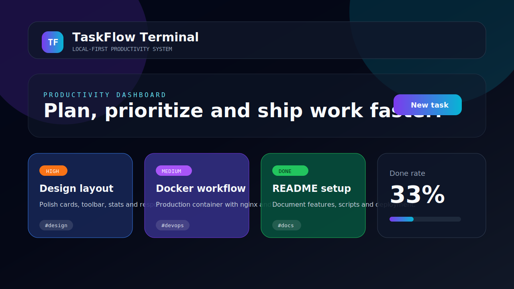

# TaskFlow Terminal

A premium local-first task manager built with **React**, **TypeScript**, **Vite** and **Ant Design**. It is designed as a portfolio-ready productivity app with a deep black / chrome liquid-glass interface, task intelligence, priorities, due dates, analytics, import/export and Docker support.



> Replace `docs/screenshots/main.svg` with real screenshots after you run the app locally or deploy it.

## Features

- Create, edit, complete, restore and archive tasks.
- Priority levels: low, medium, high and urgent.
- Optional due dates with overdue highlighting.
- Tags, descriptions and visual card customization.
- Search across title, description, tags, status and priority.
- Priority filter and sorting by last update, priority or due date.
- Analytics tab with priority-load bars, 7-day completion chart, focus index and key task statistics.
- Premium dark liquid-glass UI with subtle motion, silver tones and rounded composition.
- Task detail modal with timeline, metadata and quick actions.
- Smart daily plan that highlights the next best tasks by priority and deadline.
- Real archive flow: archive first, then delete forever from archive.
- Local-first persistence with `localStorage`.
- JSON import/export for backups and migration.
- User settings for card density, typography, accent color, glass intensity, motion intensity and compact mode.
- Responsive dashboard layout.
- Unit test coverage for the core create-task flow.
- Dockerized production build served by nginx.

## Tech Stack

- React 19
- TypeScript
- Vite
- Ant Design
- Day.js
- Vitest + Testing Library
- Docker + nginx

## Getting Started

### Prerequisites

- Node.js 20+
- npm

### Installation

```bash
npm install
```

### Development

```bash
npm run dev
```

Open the local URL printed by Vite, usually:

```text
http://localhost:5173
```

### Production Build

```bash
npm run build
npm run preview
```

### Tests

```bash
npm test
```

### Linting and Type Check

```bash
npm run lint
npm run typecheck
```

## Docker

Build the image:

```bash
docker build -t taskflow-terminal .
```

Run the container:

```bash
docker run --rm -p 8080:80 taskflow-terminal
```

Open:

```text
http://localhost:8080
```

Or use Docker Compose:

```bash
docker compose up --build
```

## Project Structure

```text
.
├── .github/workflows/ci.yml
├── docs/screenshots/
├── public/
├── src/
│   ├── api/
│   ├── components/
│   ├── pages/
│   ├── test/
│   ├── types/
│   └── utils/
├── Dockerfile
├── docker-compose.yml
├── nginx.conf
└── vite.config.ts
```

## Deployment

This is a static Vite app. You can deploy the `dist/` folder to GitHub Pages, Netlify, Vercel, Cloudflare Pages or any static hosting provider.

For GitHub Pages, keep `base: './'` in `vite.config.ts` so the app works from a repository subpath.

## GitHub Repository Setup

Suggested repository description:

```text
Polished React + TypeScript task manager with priorities, analytics, local persistence and Docker support.
```

Suggested topics:

```text
react typescript vite antd task-manager productivity localstorage docker vitest frontend
```

## Notes

The app is local-first: tasks are stored in the browser. Clearing browser storage will remove local tasks unless you export a JSON backup first.

## License

MIT


## Senior UI redesign

This version focuses on a calmer product layout: equal header/content widths, cleaner board controls, reduced visual noise, a subtle animated background, and a Today's Focus queue that makes the app feel useful immediately.


## Productivity OS upgrade

The app now goes beyond basic task tracking: workload capacity, effort estimates, energy levels, project health, a smart focus queue, JSON backup/import, archive flow, and product-grade workflow settings.


## Visual redesign reset

The CSS was reset instead of patched: wider shell, deep black/chrome palette, larger hero, redesigned cockpit panels, cleaner controls and a visibly different premium product style.
